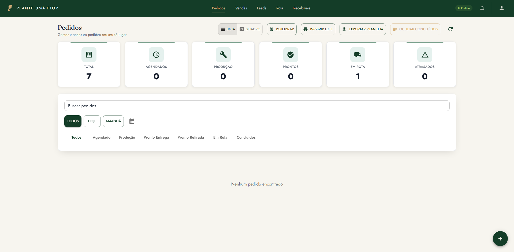
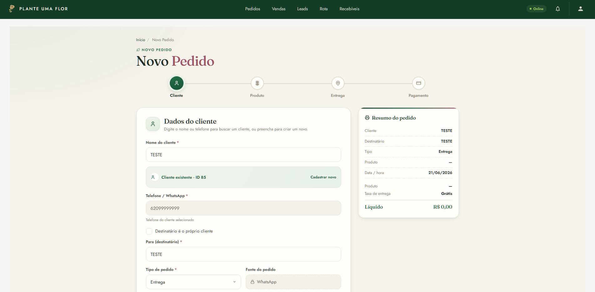
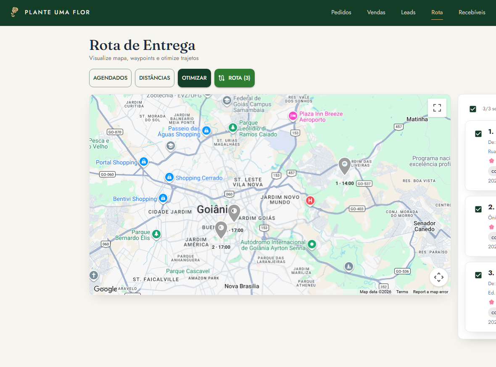
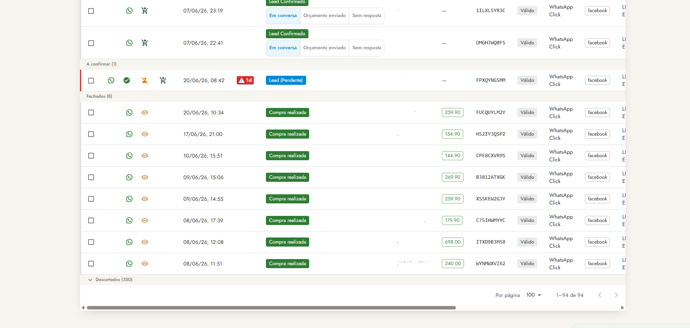
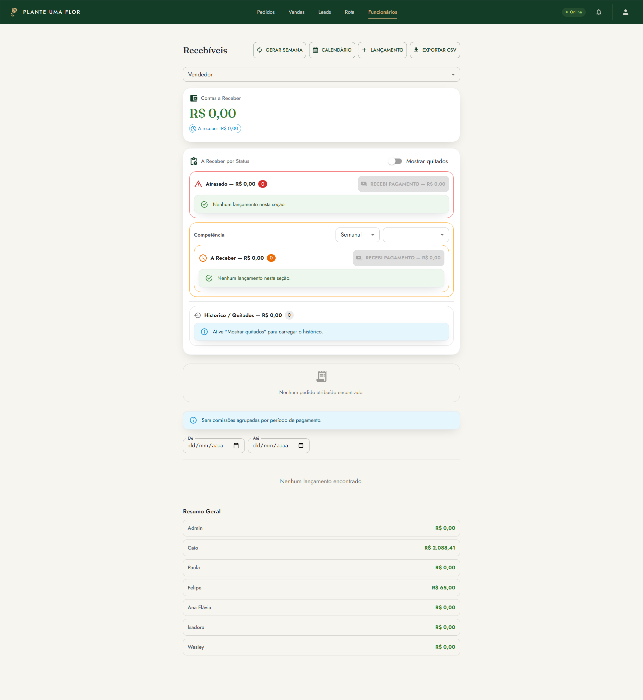
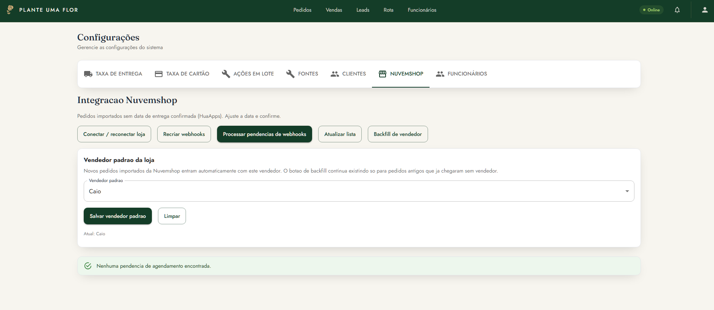

# 🌷 Plante uma Flor — Gestor de Pedidos

Sistema full-stack para operação de floricultura: **pedidos, entregas, clientes, leads, recebíveis** (folha + comissão) e **integrações** (Meta CAPI, Nuvemshop, UTMify, Google). PWA com modo offline.

<!-- 📸 Sugestão: print da tela principal / dashboard aqui -->
<p align="center">
  
</p>

| | |
|---|---|
| **Backend** | Flask 3 · SQLAlchemy 2 · PostgreSQL 16 · JWT |
| **Frontend** | React 19 · TypeScript · Vite · MUI · React Query · Dexie (PWA offline) |
| **Deploy** | Docker Compose (Waitress + SPA buildada) |

---

## 🚀 Início rápido

### Desenvolvimento (Docker com hot-reload)

```bash
git clone git@github.com:Zoriek1/GestorDePedidosIntegrado.git
cd GestorDePedidosIntegrado
docker compose -f docker-compose.dev.yml up
```

- App: **http://localhost:5173** (Vite faz proxy de `/api` → backend)
- Editou `backend/` ou `frontend/`? Recarrega sozinho.
- Primeiro admin: `docker compose -f docker-compose.dev.yml exec backend flask create-admin`

### Produção

```bash
cp .env.example .env      # preencher segredos reais (NUNCA commitar)
docker compose up -d
docker compose exec backend flask create-admin
```

App em `http://localhost:5000`.

---

## ✨ Funcionalidades

### 📦 Pedidos & Wizard de criação
Wizard guiado (cliente → arranjo → entrega → pagamento) e edição em página única. Lista com filtros, paginação e impressão de comprovantes em lote (até 100, 1/2/4 por folha).

<!-- 📸 print do wizard de novo pedido -->
<p align="center"></p>

### 🛵 Entregas & Rotas
Mapa do entregador, otimização de rota, cálculo de distância/taxa por pedido e acompanhamento de status (kanban).

<!-- 📸 print do mapa / rota do entregador -->
<p align="center"></p>

### 🎯 Leads
Funil de leads por situação (7 grupos), follow-up e exportação para planilha.

<!-- 📸 print do funil de leads -->
<p align="center"></p>

### 💰 Recebíveis (Ledger)
Razão double-entry: comissões por venda, créditos semanais (fixo, almoço, transporte) e quitação. Admin vê tudo; vendedor vê o próprio; entregador vê "Recebíveis Hoje".

<!-- 📸 print da tela de recebíveis -->
<p align="center"></p>

### 🔌 Integrações
- **Meta CAPI** — envio de eventos via outbox assíncrono (worker dedicado)
- **Nuvemshop** — importação de pedidos via webhook
- **UTMify** — conversões/atribuição
- **Google** — Sheets (export) + Drive (backup) + Maps (geocoding/rotas)

<!-- 📸 print da tela de integrações -->
<p align="center"></p>

### 📱 PWA offline
Instalável, funciona offline com Dexie + Service Worker e push notifications (VAPID).

> **📷 Como adicionar as fotos:** salve os prints em `docs/screenshots/` com os nomes acima (`dashboard.png`, `pedidos-wizard.png`, …). As imagens aparecem automaticamente aqui. Pode trocar os nomes à vontade.

---

## 🗂️ Estrutura

```
backend/     Flask app (app/), tests/, scripts/ (migrations, backup, export, meta)
frontend/    React 19 (src/features/ feature-based, app/router.tsx)
docs/        Documentação + screenshots/
deploy/      Exemplos Caddy/Nginx/systemd
docker/      Stage do build (prebuilt-dist)
```

## 📚 Documentação

- [AGENTS.md](AGENTS.md) — referência de arquitetura/convenções (p/ devs e agentes IA)
- [docs/structure.md](docs/structure.md) — arquitetura e onde colocar coisas novas
- [docs/database.md](docs/database.md) — Postgres, models, money handling, migrations
- [docs/deploy.md](docs/deploy.md) — Docker Compose, VPS, Cloudflare Tunnel
- [docs/recebiveis.md](docs/recebiveis.md) — ledger, comissões, créditos, quitação
- [docs/integrations.md](docs/integrations.md) — Meta CAPI, Nuvemshop, UTMify, Google, Push

## 🛠️ Comandos úteis

```bash
# Testes / lint (dev)
docker compose -f docker-compose.dev.yml exec backend pytest
docker compose -f docker-compose.dev.yml exec backend ruff check . --fix
docker compose -f docker-compose.dev.yml exec backend black .

# Frontend
cd frontend && npm run build && npm run lint
```

## 📄 Licença

MIT.
